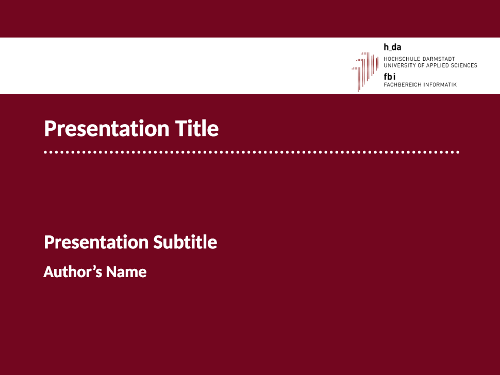

[Forked from: saitho/hda-fbi-beamer-template](https://github.com/saitho/hda-fbi-beamer-template)

# Unofficial h_da Beamer template

This template is based on the beamer template for Utrecht University made by Jurian Baas and Jan de Mooij.



## Acknowledgements

* Using GIFs in Beamer: https://tex.stackexchange.com/questions/349077/get-animated-gifs-into-latex-presentation

## Setting a faculty

You change faculties by setting the _faculty_ property in the \usetheme command.

Example for IT faculty:
```latex
\usetheme[university=hda, faculty=fbi]{fibeamer}
```

This will automatically set the faculty colours, logo and watermark.
If no faculty is set or the faculty has not been configured yet, the default h_da colors will be used.

Supported faculties:

* fbi

## Adding a new faculty configuration

In the following [faculty] is the name of your faculty (e.g. fbi, fbmn, ...).

1. Add the faculty logo file `fibeamer/logo/hda/logo-[faculty].png`. Make sure the logo has similar dimensions than the original h_da logo (logo.png).
2. Add the watermark file `fibeamer/theme/hda/watermark-[faculty].png. Make sure the logo has similar dimensions than the original h_da watermark (watermark.png).
3. Add a new file `fibeamer/theme/hda/colors-[faculty].sty` where you can set the faculty color theme.

Example:
```latex
\definecolor{fibeamer@red}{HTML}{C00A35}
\colorlet{fibeamer@primary}{fibeamer@red!60!fibeamer@black} % dark red
\colorlet{fibeamer@secondary}{fibeamer@red!30!fibeamer@white} % light red
\colorlet{fibeamer@frontMatterTextColor}{fibeamer@white} % Color of the text on the first slide
```

Additionally you can override any color that is provided via the \colorprovide command inside the `beamercolorthemefibeamer-hda.sty` file.
